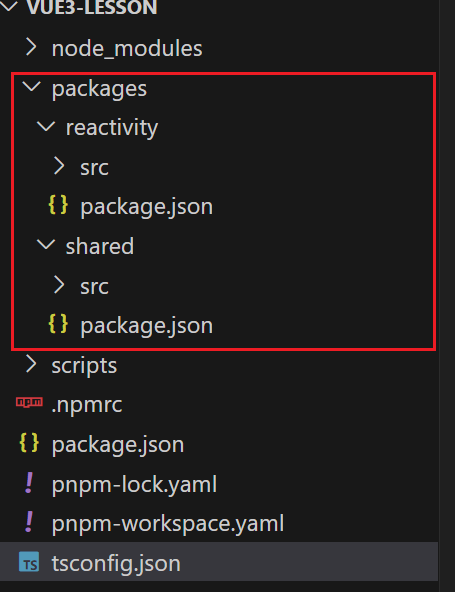

# Vue3源码环境搭建

## 采用Monorepo管理项目

管理项目代码一个方式，在一个仓库中管理多个模块/包，vue3采用Monorepo方式进行管理，将模块拆分到package目录中，作为一个个包来管理，这样职责胡凡更加明确。

- 一个仓库可维护多个模块，不用到处找仓库
- 方便版本管理和依赖管理，模块之间的引用，调用非常方便

利用pnpm搭建环境，pnpm --init搭建壳子，会生成package.json内容如下,scripts内容后面自定义

```json
{
  "name": "vue3-lesson",
  "private": "true",
  "version": "1.0.0",
  "description": "",
  "main": "index.js",
  "type": "module",
  "scripts": {
    "dev":"node scripts/dev.js reactivity -f esm"
  },
  "keywords": [],
  "author": "",
  "license": "ISC",
  "packageManager": "pnpm@10.13.1",
  "dependencies": {
    "vue": "^3.5.17"
  },
  "devDependencies": {
    "esbuild": "^0.25.6",
    "minimist": "^1.2.8",
    "typescript": "^5.8.3"
  }
}
```

还需要下载相关依赖pnpm install typescript esbuild minimist -D -w

typescript：代码是用ts编写的

esbuild：打包所需要的依赖包

minimist：将命令行输入转化为js对象，下面会用到

## 目录结构

添加pnpm-workspace.yaml，这个用来指定，我们项目多个模块存放的位置，在根目录下也需要创建对应的packages文件夹

```yaml
packages:
 - "packages/*"
```



## ts的配置

```json
{
  "compilerOptions": {
    "outDir": "dist",//输出的目录
    "sourceMap": true,//采用sourcemap
    "target": "es2016",//目标语法
    "module": "esnext",//模块格式
    "moduleResolution": "node",//模块解析方式
    "strict": false,//严格模式
    "resolveJsonModule": true,//解析json模块
    "esModuleInterop": true,//允许通过es6语法引入commonjs模块
    "jsx": "preserve",//jsx 不转义
    "lib": ["esnext","dom"],// 支持的类库 exnext,dom
    "baseUrl": ".", //
    "paths": {
      "@vue/*":[ "packages/*/src" ]
    }
  }
}

```

## 如何打包

新建scripts文件夹， 在scripts下新建dev.js作为打包的需要执行的文件，执行npm run dev,就会寻找package.json中scripts对应的命令,然后会执行dev.js，（reactivity -f esm）这些则是参数会被process.argv获取到

```json
"scripts": {
    "dev":"node scripts/dev.js reactivity -f esm"
  },
```

dev.js文件内容如下

```js
//这个文件会帮助我们打包 package下的模块 ，最终打包出js文件

//node scripts/dev.js (要打包的名字:reactivity -f 打包的格式:esm) === argv
import minimist from "minimist"
import { resolve , dirname } from 'path'
import { fileURLToPath } from "url"
import { createRequire } from "module"
import esbuild from "esbuild"
//node 中的命令函数参数通过process 来获取 process.argv
const args = minimist(process.argv.slice(2))
const __filename = fileURLToPath(import.meta.url)
const __dirname = dirname(__filename)
const require = createRequire(import.meta.url)
const target = args._[0] || "reactivity"
const format = args.f || "iife"

//入口文件 根据命令行提供的路径来进行解析
const entry = resolve(__dirname, `../package/${target}/src/index.ts`)
const pkg = require(`../packages/${target}/package.json`)

esbuild.context({
  entryPoints: [entry],//入口
  outfile: resolve(__dirname, `../package//${target}/dist/${target}.js`),//出口
  bundle: true, // reactivity 依赖-> shared 会打包到一起
  platform:"browser", // 打包后给浏览器使用
  sourcemap:true,
  format,
  globalName: pkg.buildOptions?.name
})
console.log(args);
```

- minimist用来配合，获取命令行的指令，需要从那个文件夹下开始打包

- 利用dirname，fileURLToPath，createRequire等获取打包入口文件地址，出口文件地址

- 最后使用esbuild工具打包，配置项如上

打包后的文件